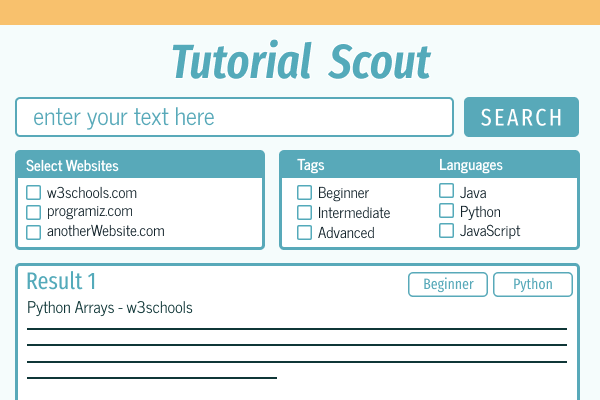

# README - Tutorial Scout

<p align="left"> 
  
</p>
<!-- no empty line here -->

# About Tutorial Scout


Tutorial Scout is a JavaFX desktop application designed to simplify the process of finding beginner to advanced coding 
tutorials. It scrapes content from trusted sources like [w3Schools](https://www.w3schools.com/) and [Programiz](https://www.programiz.com/), 
and presents it in a clean, filterable UI. Users can sort tutorials by difficulty, programming language (Java, Python,
JavaScript), and source, in a smooth card-style layout.

This project was born out of a desire to reduce the overwhelm of searching for quality learning materials online. 
It’s also designed with future scalability in mind — with plans to support more sources, 
video content, and even AI-driven summaries. This app is a practical extension of my mission to make tech more accessible.


---

##  Features

- Keyword-based tutorial search
- Source filters: w3Schools, Programiz
- Tag filters: Beginner, Moderate, Advanced
- Language filters: Java, Python, JavaScript
- Scrollable, card-style UI with live search results
- Styled with custom JavaFX CSS
- Optionally expandable with full AI summaries (ApyHub-ready)

---

##  UI Preview

Styled using custom CSS - Planned out with Figma:

- Fira Sans & News Cycle font families
- Scrollable results
- Pill-style filter tags

### Planed Out Mockup with Figma:
<p align="left"> 
  
</p>


---

## Tech Stack

- **Java 17+**
- **JavaFX** for UI
- **Jsoup** for HTML parsing
- **OkHttp** for HTTP requests
- **Gson** for JSON parsing
- **ApyHub API** (planned + can be implemented)

---

##  Project Structure

```java
/*
tutorial-scout/
├── src/
│   └── main/
│       ├── java/
│       │   ├── module-info.java 
│       │   └── com.raphael.tutorialscout/
│       │       ├── ui/
│       │       │   └── TutorialScout.java           
│       │       ├── backend/
│       │       │   ├── ProgramizScraper.java        
│       │       │   ├── w3GoogleCSEScrapper.java      
│       │       │   └── api/
│       │       │       └── ApyHubSummaryClient.java  
│       │       │   └── demos/
│       │       │       └── ProgramizScraperTest.java 
│       │       │       └── w3GoogleCSEScraperDemo.java 
│       resources/
│       ├── fonts/                                         
│       │   ├── FiraSansExtraCondensed-Regular.ttf
│       │   ├── FiraSansExtraCondensed-BoldItalic.ttf
│       │   ├── NewsCycle-Bold.ttf
│       │   └── NewsCycle-Regular.ttf
│       └── style.css                                     
│       lib/                                               
│       ├── okhttp-4.12.0.jar
│       ├── okio-jvm-3.9.0.jar
│       ├── kotlin-stdlib-1.9.0.jar
│       ├── gson-2.10.1.jar
│       ├── jsoup-1.17.2.jar
│       └── json-20240303.jar
├── [README.md]
                                       
 */
```

##  Setup & Running the App

1. **Download** the project folder
2. Open in **IntelliJ IDEA** (recommended).
3. Add all `.jar` files in `/lib` as **Module Dependencies** (marked as `Classes`).
4. Set `TutorialScout.java` as your main class.
5. Click **Run** to launch the app.

---

## Dependencies

All JARs required for the project are included in `/lib`.

| Library | Version | Purpose |
| --- | --- | --- |
| OkHttp | 4.12.0 | HTTP client |
| Okio (JVM) | 3.9.0 | Required by OkHttp |
| Kotlin Stdlib | 1.9.0 | Required by OkHttp/Okio |
| Gson | 2.10.1 | JSON parsing |
| Jsoup | 1.17.2 | HTML parsing |
| org.json | 20240303 | Optional JSON fallback |

---

## Limitations

- The **ApyHub AI Summarization API** is included but not actively used due to free-tier limits.
- Currently, tutorial results use text snippets from the source websites, not AI summaries.
- Limited to two sources: **w3Schools** and **Programiz**. With plans for further development to other
  websites like **GeeksForGeeks**.
- Tags are limited: So far it only includes **difficulty** and **three languages**. Future development includes 
  more languages as well as more filter options. **Current work around** is specifying the language in the search field, and not selecting a tag.

---

## Future Plans

- **Upgrade** or replace the ApyHub API with a more scalable summarization solution.
- **Add support** for more tutorial sources (GeeksforGeeks, MDN, freeCodeCamp).
- **Handle** conflicting search queries and tags.
- **Optimize** the search function.
- **Export** results to PDF or save for offline reading.

---

## License

This project is licensed under the [MIT License](LICENSE). Feel free to use, modify, and distribute it for personal or commercial purposes. See the full license text in the `LICENSE` file for more details.

---

## Author - Raphael King

**Student developer**

One of my passion projects is Everyone Can Code, an initiative dedicated to making computer science more accessible and inclusive. It started as a student-led organization back in high school, and it’s now evolving into a long-term vision for a diverse and welcoming tech community. While it’s still in the works, the foundation is laid, with plans to grow it into something bigger in the years ahead (nonprofit). I believe coding should be approachable for everyone, no matter their background — and I’m committed to building tools, resources, and spaces that reflect that belief.

---
